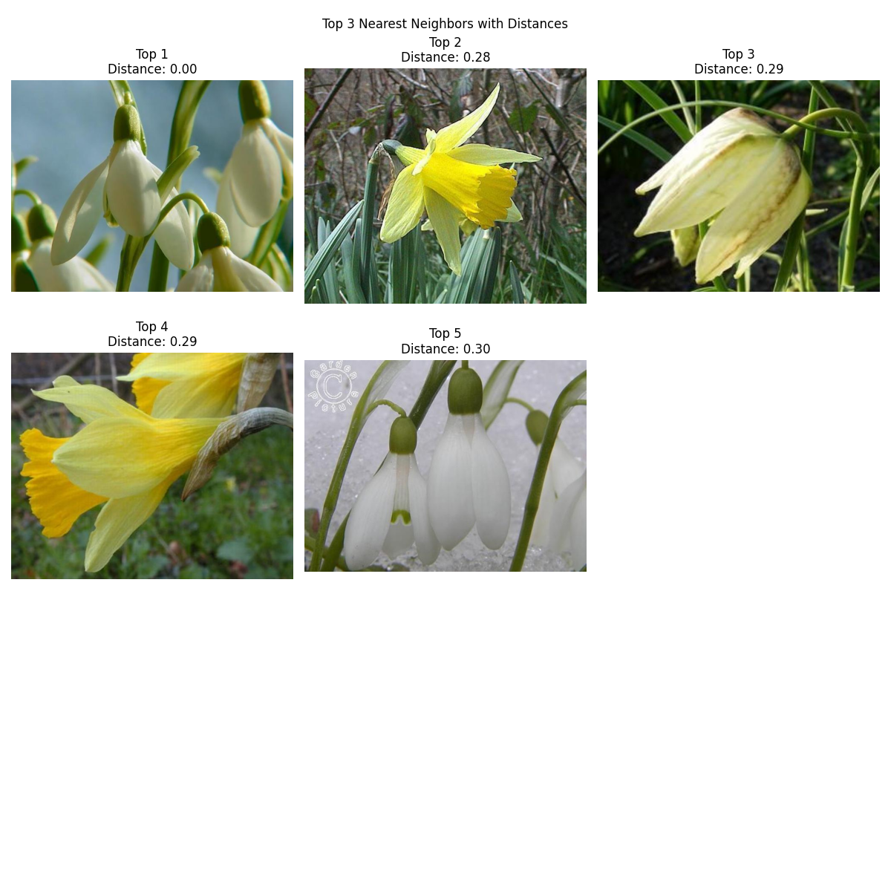

# A1: Building a simple image search algorithm
## Overview

This project consists of two image search programs. The first script *img_search.py* is a simple algorithm which takes a user-defined image, compares it to all other images in the dataset and returns a list of the five most similar images based on histogram similarity. This is done by utilizing `OpenCV`'s `calcHist()`, `normalize()` and `compareHist()` functions. These functions 1: calculates histograms of all images 2: normalizes the histogram values, ensuring their mutual compatibility and 3: calculates the chi-square distance between images. <br>
Lastly, `Pandas` is used to create a dataframe of the calculated distances between images and save it as a CSV file.

The second script *knn_search.py* is a more advanced pretraineed neural network based on the `VGG16` CNN. Instead of just comparing pixel values between histograms, this model extracts a list of more abstract features from each image, runs them through a *k*-nearest neighbor algorithm to calculate distance, and plots the most similar images together. The scripts utilizes `TensorFlow` to load and preprocess images and initialize the `VGG16` model, along with `NearestNeighbors` from `scikit-learn` for the *k*-nearrest neighbor algorithm.

## Table of Contents

- [Repo Structure](#repo-structure)
- [Data Source and Prerequisites](#data-source-and-prerequisites)
- [Reproducing the Analysis](#reproducing-the-analysis)
- [Key Points from the Outputs](#key-points-from-the-outputs)
- [Discussion of Limitations and Possible Improvements](#discussion-of-limitations-and-possible-improvements)

## Repo structure

```bash
a1
├── README.md
├── in
│   └── flowers
├── out
│   ├── nearest_neighbors_with_distances.png
│   └── similar_images.csv
├── requirements.txt
├── run_img_search.sh
├── run_knn.sh
└── src
    ├── img_search.py
    └── knn_search.py
```

## Data Source and Prerequisites:

The dataset used for the  is a collection of 1,360 images of flowers common to the UK distributed across 17 different classes. More information about the dataset, its authors, as well as a download link to a compressed file of the images can be found [here](https://www.robots.ox.ac.uk/~vgg/data/flowers/17/).

The main script was written and executed using ```Python v.1.89.1```.
For the processing and analysis of the data, the following packages were used:

```

```

## Reproducing the Analysis:

Before running the script, the unzipped folders containing the datasets should be placed in the *in* folder as shown in the repo tree above. The *flowers* folder contains a couple .txt files which can safely be deleted prior to the analysis.

To reproduce the analysis, change directory to *a1* and run either *run_img_search.sh* for the simple algorithm or *run_knn.sh* for the CNN-based image search.

```bash
cd local_path_to_a1
```

```bash
bash run_img_search.sh || bash run 
```

You will be prompted to enter the number of the target image. This is the number contained in the file name of the image (e.g., image_**0045**.jpg). Only input the number without any extensions. 

Note that it might take up to a few minutes for the program to run.

<br>

*run_img_search.sh* and *run_knn.sh* both perform the following actions:

1. Sets up a virtual environment called *.venv* in the root directory using ```venv```:
   ```sh
   python -m venv .venv
   ```
2. Activates the environment:

   ```sh
   source .venv/bin/activate
   ```
3. Fetches and installs required dependencies:

   ```
   pip install -r requirements.txt
   ```
4. Runs the Python script:
   ```
   python img_search.py || python knn_search.py
   ```

## Key Points from the Outputs:

| Filename        | Distance |
|-----------------|----------|
| target          | 0.0      |
| image_1303.jpg  | 2.47     |
| image_0248.jpg  | 2.47     |
| image_0247.jpg  | 2.47     |
| image_0791.jpg  | 2.56     |

The resulting dataframe displays the individual filenames along with ther computed chi-square distance to the target image selected by the user. The smaller the values, the more similar the color distributions of the images are. 

While this approach appears to work quite nicely on a smaller, quite homogenous dataset such as the 17 Category Flower Dataset which contains classes that each have a very distinctive color palette, it is important to stress that this analysis only compares the distribution of pixel values between images, and not any other abstract features that an image might contain. 

Therefore, if one was to be able to compare more different classes of images with each other, more advanced machine learning pipelines would be necessary to ensure proper performance. For the second analysis, a pretrained neural network based on the `VGG16` model was utilized. This approach exploits convolutional layers to extract unique featues from the dataset, resulting in far greater precision. For example, the largest euclidian distance between the target image and the fifth most similar is 0.30 compared to the distance of 2.56 in the more primitive method.

