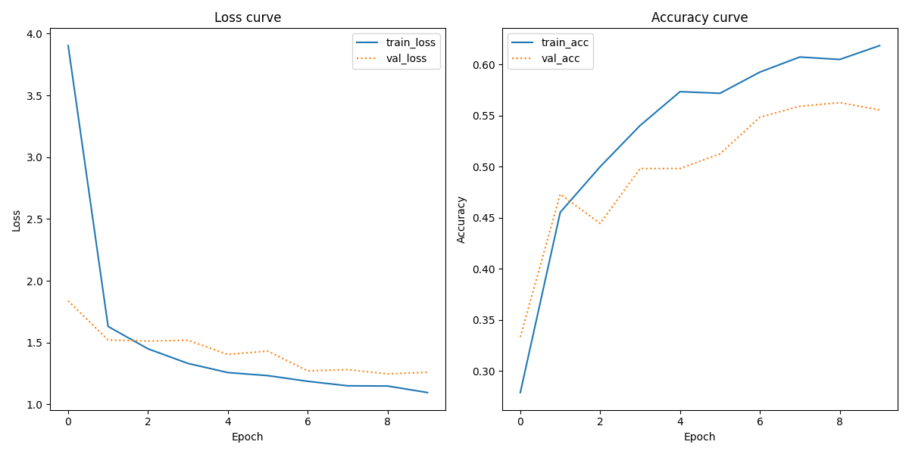

# A3: Document classification using pretrained image embeddings
## Overview
The goal of the following project is to predict the various types of document based on their visual characteristics rather than the actual text content itself. This is done via transfer learning; a CNN is trained using image embeddings from ```VGG16``` on a large dataset of images of various document types, including advertisemetns, e-mails, scientific papers, newspapers, among others.

Using the ``Keras`` API from ``TensorFlow`` along with utilities from ``scikit-learn``, the program loads and preprocesses the images, generates labels, trains a classifier, and generates a classification report and learning curves. By freezing the convolutional layers of the pretrained CNN, we are able to use the pretrained kernels of ```VGG16``` and add a dense layer of 128 neurons with a ReLu activation function in order to train a specialized model on our own dataset. Finally, an output layer (Dense with 10 neurons and softmax activation function) is added. For more detailed comments on the individual steps, please refer to docstrings and comments within the source code.

## Table of Contents

- [Repo Structure](#repo-structure)
- [Data Source and Prerequisites](#data-source-and-prerequisites)
- [Reproducing the Analysis](#reproducing-the-analysis)
- [Key Points from the Outputs](#key-points-from-the-outputs)
- [Discussion of Limitations and Possible Improvements](#discussion-of-limitations-and-possible-improvements)

## Repo structure

```bash
a3
├── README.md
├── in
│   └── Tobacco3482
│       ├── ADVE
│       ├── Email
│       ├── Form
│       ├── Letter
│       ├── Memo
│       ├── News
│       ├── Note
│       ├── Report
│       ├── Resume
│       └── Scientific
├── out
│   ├── classification_report.txt
│   └── plots.png
├── requirements.txt
├── setup.sh
└── src
    └── classifier.py
```

## Data Source and Prerequisites

For this project, ``Tobacco3482`` is used. This dataset consists of 3842 images across 10 different document types as shown in the repo structure above. Further information about the authors and the contents of the dataset, as well as a download link can be found on [Kaggle](https://www.kaggle.com/datasets/patrickaudriaz/tobacco3482jpg?resource=download).
<br>

The main script was written and executed using ```Python v.1.89.1```. 
For the processing and analysis of the data, the following packages were used:

```
matplotlib==3.9.0
numpy==1.26.4
scikit_learn==1.5.0
tensorflow==2.16.1
```

## Reproducing the Analysis:
Before running the program, the Tobacco3482 folder including all subfolder should be placed in the *in* directory as showcased in the repo structure above.

To reproduce the analysis, change directory to *a4* and run *run.sh* from the from the terminal:
```bash
cd a3
bash run.sh
``` 
 *run.sh* performs the following actions:
1. Sets up a virtual environment called *.venv* in the root directory using ```venv```:
    ```sh
    python -m venv .venv
    ```
2. Activates the environment:
    ```sh
    source .venv/bin/activate
    ```
3. Fetches and installs required dependencies:
    ```
    pip install -r requirements.txt
    ```
4. Runs the main Python script:
    ```
    python src/classifier.py
    ``` 


## Key Points from the Outputs:
Generally, based on the classification report, the model seems to perfom somewhat decently with an overall accuracy of 0.64 and an F1-score of 0.62. 

However, evaluating the scores of individual categories of documents, perfomance of the model varies greatly with F1-scores anywhere between two extremes of 0.27 and 0.90. The categories advertisement, e-mail, news, and note appear to stand out with overall higher F1-scores than the rest of the dataset. While the direct cause is uncertain, one possible explanation might be that these categories more frequently include other modalities than text, such as images or sketches which are features that may potentially translate as more visually distinct features.

Apart from F1, precision and recall scores differ quite a bit across the categories. Two contrasting categories in this regard is the form and email category. While the model seems be doing well at identifying true positives while missing some in the email category, it tends to more frequently misclassify images as belonging to the form category.


## Discussion of Limitations and Possible Steps to Improvement

<table>
  <tr>
    <td style="width: 50%; font-size: 12px;">

### Classification report

| Class      | Precision | Recall | F1-Score | Support |
| ---------- | --------- | ------ | -------- | ------- |
| ADVE       | 0.93      | 0.87   | 0.90     | 45      |
| Email      | 0.92      | 0.84   | 0.88     | 124     |
| Form       | 0.47      | 0.77   | 0.59     | 93      |
| Letter     | 0.76      | 0.41   | 0.53     | 124     |
| Memo       | 0.53      | 0.66   | 0.59     | 124     |
| News       | 0.92      | 0.85   | 0.88     | 26      |
| Note       | 0.79      | 0.64   | 0.71     | 36      |
| Report     | 0.48      | 0.53   | 0.50     | 59      |
| Resume     | 0.50      | 0.18   | 0.27     | 22      |
| Scientific | 0.36      | 0.34   | 0.35     | 44      |
| **Avg / Total** | **0.67** | **0.61** | **0.62** | **697** |

</td>
</tr>
</table>

For this project, not a lot of fine tuning of the model's hyperparameters was done. Doing so, e.g. by changning its learning rate or batch size may very well improve the performance of the model. Further experimentation would be benefecial, as would employing techniques such as a grid search. Further, while `VGG16` is popular and highly regarded CNN for computer vision tasks, other CNNs may prove to be more optimal for this task. 

Another point worth mentioning is the fact that according to the individual support scores for each category, the dataset appears to be fairly unbalanced, with the largest categories containing more than five times as many images as the smallest. One way of remedying this would be to apply data augmentation methods such as rotating, flipping, or cropping images. 



Assessing the plots generated for the loss and accuracy curves, we can conclude that while the loss curves for the train and test splits appear to follow each other reasonably closely, when it comes to the accuracy curves, the two diverge quite significantly after only two epochs. This indicaates that in terms of accuracy, the model is overfitting to the training data. One possible reason this is happening is a lack of training data; another likely reaso is that the model is simply poorly configured. Further experimentation with hidden layer sizes could potentially prove beneficial to performance of the model.